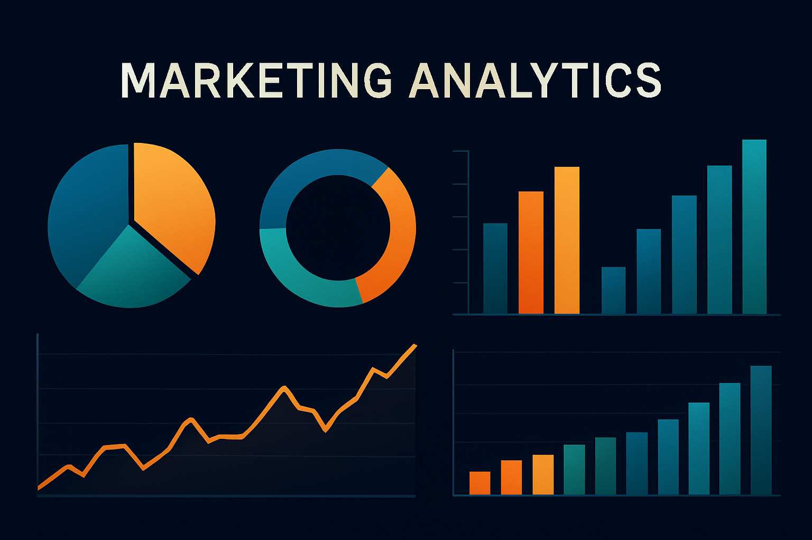

# 📊 Marketing Campaign Analysis



Final project for **Module 1** of the **Data Analyst & AI Bootcamp** at Upgrade Hub.

This project analyzes a dataset from a marketing campaign to uncover insights about customer behavior, product preferences, and campaign effectiveness. It includes data cleaning, exploration, visualization, and basic feature engineering, following best practices in data analytics.

---

## 🧠 Objectives

- Perform **exploratory data analysis (EDA)** on customer and campaign data.
- Identify **key trends** and **segmentation opportunities**.
- Apply **data visualization** techniques to communicate findings clearly.
- Draw **actionable insights** to support marketing decision-making.

---

## 🖼️ Dashboard Banner Image

The banner was generated using AI (DALL·E) with the following prompt:
A dashboard-style layout with dynamic marketing analytics displayed against a dark backdrop, featuring charts and graphs in vibrant shades of blue, orange, green, and teal. Includes pie chart, donut chart, bar graphs, and line graph. Clean and modern design.

To generate a similar image:
- Use [DALL·E](https://openai.com/dall-e) or a Stable Diffusion interface.
- Set your aspect ratio to **landscape** or **wide**.
- Include keywords like “dashboard”, “marketing analytics”, and “data visualization”.
- Add `no text` or `no labels` to avoid unwanted text in the image.

---

## 🗃️ Dataset

The dataset contains customer information such as demographics, purchasing behavior, and responses to marketing campaigns.

**Key features include:**
- Age, education, income, marital status
- Product categories (wine, meat, gold, etc.)
- Marketing campaign responses
- Spending and purchasing patterns

---

## 🧹 Data Cleaning & Preprocessing

- Missing values treated
- Outliers handled
- Feature formatting and transformation
- Created new variables for analysis (e.g., total spend, customer profile scores)

---

## 📈 Tools & Libraries

- `Python`
- `Pandas`
- `NumPy`
- `Matplotlib`
- `Seaborn`
- `Jupyter Notebook`

---

## 📊 Key Findings

- **Best customer profiles** based on spending and campaign responsiveness
- Differences in product preferences by **age**, **income**, and **marital status**
- **Underperforming campaign segments** and improvement opportunities
- Visualization of correlations, distributions, and customer segmentation

---

## 📂 Project Structure

m1project_marketing_analysis/
│
├── data/                  # Raw and processed data
├── notebooks/             # Jupyter Notebooks
├── images/                # Plots and visualizations
├── README.md              # Project documentation
└── marketing_analysis.ipynb  # Main analysis notebook

---

## 📌 How to Run

1. Clone the repository:
   ```bash
   git clone https://github.com/patriciajaquez/m1project_marketing_analysis.git
   cd m1project_marketing_analysis

2.	Open the Jupyter notebook:
    jupyter notebook notebooks/marketing_analysis.ipynb

3.	Follow the step-by-step analysis in the notebook.

⸻

👩‍💻 Author

Patricia Jáquez
Data Analyst & AI Bootcamp – Upgrade Hub
🔗 LinkedIn

⸻

📝 License

This project is shared for educational purposes as part of the Upgrade Hub Bootcamp. Feel free to use and adapt it with proper attribution.

⸻
